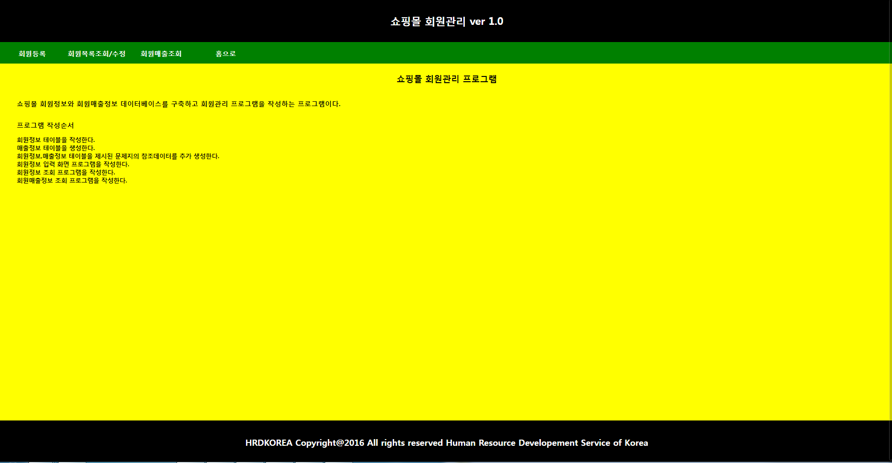
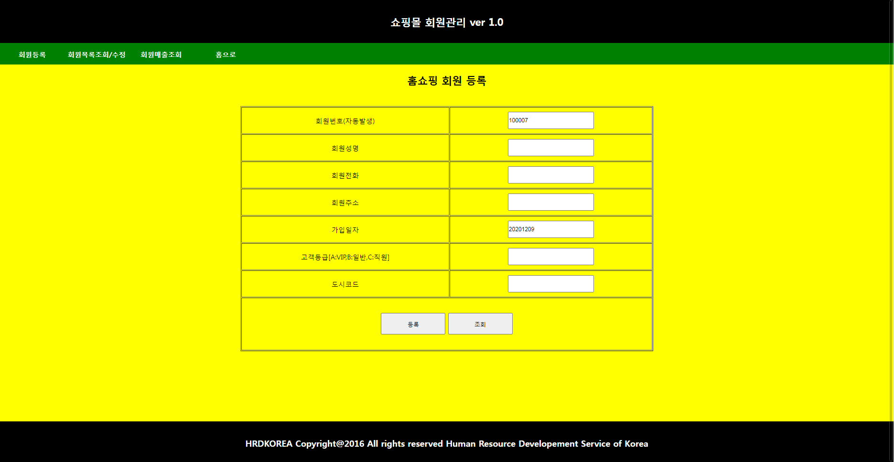
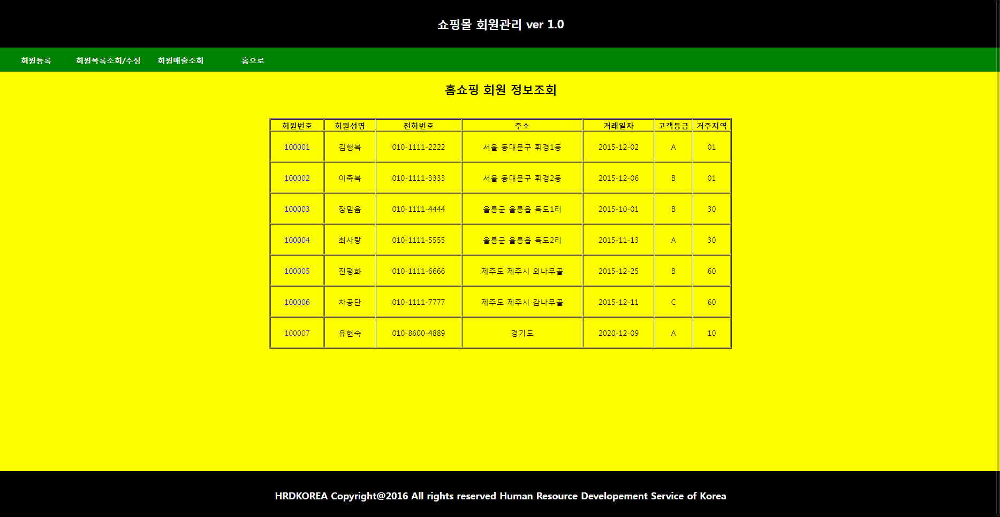
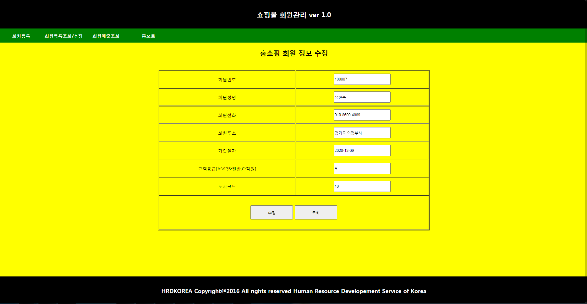
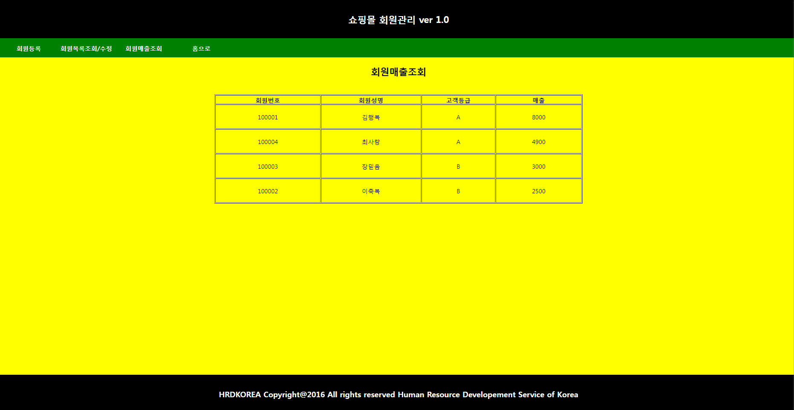

# 1. 메인화면

  
  

## 설명 
### 첫 메인화면 index.jsp 화면이다. header,nav,content,footer로 구성되어 있으며 nav에 메뉴바에 ul>li>a로 구성되어 있어 클릭하면 다른 페이지로 이동한다.

----------------------------------------------------------------------------------------------------------------------------------------------

# 2. 회원등록화면

  
  

## 설명 
### memberIns.jsp 회원 등록화면이다. 회원번호와 가입날짜는 자동으로 생성되게 작성하였고 memberInsPro.jsp 화면에서 insert into 테이블 이름 values(들어갈값);
### 을 사용하여 회원등록이 되게 작성하였다. 만약 값이 들어가있지 않으면 값이 입력되지 않았다는 alert 문이 나오게 작성하였다.

----------------------------------------------------------------------------------------------------------------------------------------------

# 3.회원목록조회

  
  

## 설명 
### memberList.jsp 회원목록조회 화면이다. 여기서 회원번호를 클릭하면 회원정보수정 페이지로 이동하게 작성하였다.

----------------------------------------------------------------------------------------------------------------------------------------------

# 4. 회원정보수정

  
  

## 설명 
### memberEdit.jsp 화면이다. 회원정보 수정을 할수 있는 페이지다 값을 입력하지 않으면 입력하지 않았다는 alert 문이 나오고 값을 입력하고 수정버튼을 누르면
### 회원 수정이 완료되었다는 alert문이 나오며 memberList.jsp 회원목록조회 페이지로 이동하게 된다.

----------------------------------------------------------------------------------------------------------------------------------------------

# 5. 회원매출조회 

  
  

## 설명 
### memberSearch.jsp 회원매출조회 화면이다. table member_tbl_02, money_tbl_02 두개 테이블을 조인하여 회원번호,회원성명,고객등급,매출에 대한 값을 출력하였다.

----------------------------------------------------------------------------------------------------------------------------------------------
